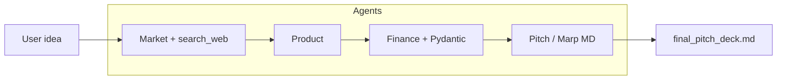

# Startup Pitch Deck

Multi-agent pipeline that turns a short startup idea into **market research**, **product spec**, **structured financial strategy**, and a **Marp-style Markdown pitch deck**—using [Hugging Face smolagents](https://github.com/huggingface/smolagents) and OpenAI-compatible models (`gpt-4o` by default).

**Repository:** [github.com/Saivenkat8/startup-pitch-deck](https://github.com/Saivenkat8/startup-pitch-deck)

---

## What it does

| Stage | Agent | Behavior |
|--------|--------|----------|
| **1. Market** | Market analyst | Clarifying questions when the idea is vague; **DuckDuckGo web search** for real competitors and trends; structured report (problem, users, TAM/SAM/SOM, risks, business model hints). |
| **2. Product** | Product manager | Feature and spec narrative from the market report. |
| **3. Finance** | Financial analyst | JSON output validated against a **Pydantic** `FinancialStrategy` schema (revenue streams, pricing, costs, investment, logic). |
| **4. Pitch** | Pitch creator | Single Marp-friendly Markdown deck from the three prior stages (no invented numbers—uses only supplied context). |

The **orchestrator** chains these steps, **file-caches** intermediate artifacts (`market_cache.txt`, `product_cache.txt`, `finance_cache.txt`), and writes **`final_pitch_deck.md`** on success.

**Clarification flow:** If the market agent ends with a question, the pipeline returns `{ "status": "paused", "data": "..." }` without writing the market cache. Call again with the same idea and a `clarification` string to resume. The **Streamlit** UI supports this flow.

---

## Architecture



---

## Requirements

- **Python 3.10+**
- **OpenAI API key** (used via smolagents `OpenAIServerModel`)

---

## Setup

```bash
git clone https://github.com/Saivenkat8/startup-pitch-deck.git
cd startup-pitch-deck

python -m venv .venv
# Windows:
.venv\Scripts\activate
# macOS/Linux:
# source .venv/bin/activate

pip install -e .
# UI dependencies are included if you use requirements.txt; otherwise:
pip install -e ".[frontend]"
```

Create a **`.env`** file in the project root (see `.env.example`):

```env
OPENAI_API_KEY=sk-...
```

---

## Usage

### Web UI (Streamlit)

From the **repository root** (after `pip install -e .`):

```bash
streamlit run frontend/app.py
```

Enter your idea, run the pipeline, and answer any follow-up question from the market analyst. Your original idea is kept in session state when you submit a clarification.

### CLI / script

```bash
python orchestrator/main.py
```

Or use the console entry point (after editable install):

```bash
startup-pipeline
```

### Clear caches

Delete `market_cache.txt`, `product_cache.txt`, and/or `finance_cache.txt` to force regeneration of those steps.

---

## Project layout

```
agents/           # ToolCallingAgent definitions (market, product, finance, pitch)
tools/            # @tool helpers (e.g. web search)
orchestrator/     # Pipeline: run_startup_pipeline(), main entry
frontend/         # Streamlit app
tests/            # Pytest tests
pyproject.toml    # Package metadata & optional [dev] / [frontend] extras
requirements.txt  # Pip-friendly dependency list
```

---

## Development

```bash
pip install -e ".[dev]"
python -m pytest
```

Tests assume the package is installed or `pythonpath` is configured (see `pyproject.toml`).

---

## Tech stack

- **smolagents** — agent loop, tools, OpenAI server model  
- **pydantic** — financial output schema  
- **duckduckgo-search** — market research tool  
- **streamlit** — optional UI  
- **python-dotenv** — local configuration  

---

## License

This project is provided as-is for learning and prototyping. Add a `LICENSE` file if you want a formal open-source terms.

---

## Author

[Saivenkat8](https://github.com/Saivenkat8) · [startup-pitch-deck](https://github.com/Saivenkat8/startup-pitch-deck)
